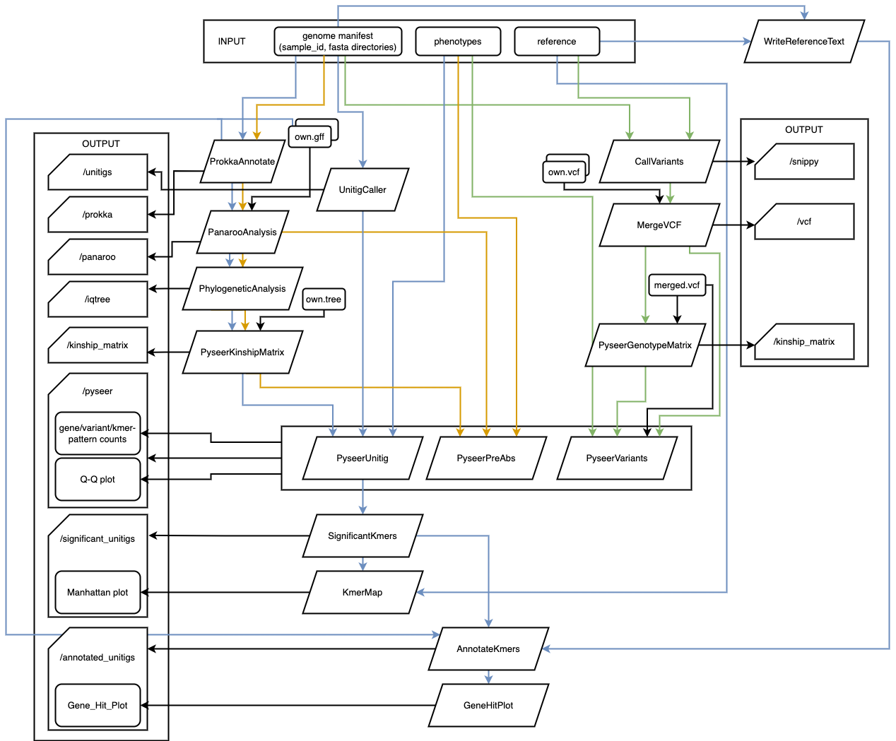

# Hi
Please bear with me that this manual is still a work in progress. The following content are taken from my unfinished, unsubmitted project report/disseration. 

## hello world

If you have an idea of a good name for this pipeline please suggest, I have not come up with a good name for 4 months now.

### This is a flowchart for a general understanding how the pipeline works

## Overview
This pipeline should ease the process of conducing microbial GWAS. 

## 1. Input sources
Allowing user customisation, the pipeline allows multiple input options (you can also use "--help" to see), as can be seen in the flowchart. The pipeline will check input formats with “manifest” to ensure that the expected inputs of the pipeline, given a selected option, match with the manifest file that the user provided. The “genome_manifest” file is a CSV with first column listing all sample ids and the second column listing their paths.  

The user can directly input genomic DNA sequences that have already been assembled and presented in FASTA format. These assembly files will be fed into Prokka (version, citation) for annotation. The best type of input is complete sequences that do not contain any gaps, but it is anticipated that in reality, the usual input will consist of scaffold sequences generated by de dovo assembly software. 

If the user already has annotated GFF files, they can supply these additionally in a similar manifest form instead, skipping the annotation step. The “sample_id” of this CSV file must match with the with “sample_id”s in the genome_manifest file.  

The pipeline also gives the user the freedom to supply their own phylogenetic tree, instead of building one from the core gene alignment produced from upstream processes. 

Besides, the pipeline requires information about the phenotype of interest. This can be in the form of a TSV file that has the first column of all the bacterial isolates and the second column documenting whether the isolate was resistant to an antibiotic, for example. Multiple columns of different phenotypes can present on the TSV file and the column name matching the name that the user specified in the option ‘--antibiotic’ is selected. If the user don’t specify this option, the last column will be used. 

Last but not least, the user must specify, through the option ‘--genotype_method’, one of the three variant genotype methods: (1) k-mers/unitigs (“unitig”); (2) gene presence or absence (“pa”); (3) SNPs (“snp”). If unsure, I recommend the “unitig” approach, as it is the main variant of choice that the GWAS tool used by this pipeline, Pyseer, was built upon. (I haven’t really completed workflow yet.)

You can find some example input files in the /example_input folder to help with the formatting. 

## 2. Annotation
Annotation from assembled genomic DNA files is done by Prokka (version) (Seemann, 2014), which relies on a range of prediction tools to identify genomic coordinates. Most of these tools, except Prodigal, provide both coordinates and descriptions for each feature. Prodigal predicts coding sequence coordinates but does not describe the gene product. 

Annotation of protein-coding genes occurs in two stages. Firstly, Prodigal identifies potential gene coordinates. Then, to predict a gene’s function, Prokka compares it against various databases, transferring annotations from the best matches. This process is hierarchical, starting with small, reliable databases, moving to larger, domain-specific ones, and finally to curated portion family models. Prokka employs a default e-value threshold of 1e-6 (10^-6) in this process. 

Prokka outputs 10 files with a common prefix, which is set by the “sample_id” by the user in the “manifest”. The pipeline selects only the GFF file in each subfolder and collects them all into one Nextflow channel, ready to be carried into the next process. 

## 3. Building multiple sequence alignment of core genes from pangenome
From the annotated assemblies from Prokka or user input, the pipeline runs Panaroo (version) (Tonkin-Hill et al, 2020) with the option to build a multiple sequence alignment of the core genes using MAFFT. Panaroo uses pangenome evolution models instead of gene accumulation curves, and it constructs a pangenome’s graphical representation, where genes form the nodes and edges link genes that are adjacent on at least one contig. This initial graph is then refined through several cleaning steps to address common issues in genome annotation. 

Panaroo outputs several files, including the gene presence/absence format and core and accessory genome alignments, created using the alignment tools MAFFT. The user can modify the pipeline code to use other alignment tools supported by Panaroo such as Prank or Clustal Omega. The annotated pangenome graph produced by Panaroo is in GML format, compatible with Cytoscape for convenient visualisation. The user can access this graph in the output folder for this process. The pipeline specially stores the core gene alignment file and the presence/absence Rtab file in two individual channels, ready to be used in downstream processes. 

## 4. Building phylogeny from the core gene alignment
To control for population structure in the downstream association study, the pipeline uses IQ-TREE (version) (Nguyen et al, 2015) to build a phylogeny from the core gene alignment. IQ-TREE is a fast stochastic algorithm which constructs phylogenetic trees using maximum likelihood. It uses a fast hill-climbing NNI algorithm repeatedly to determine locally optimal trees for the initial tree generation and retain the best topologies with the highest likelihood. Subsequently, they use a stochastic NNI step to allow the locally optimal trees in the selected set to be randomly perturbed and potentially escape from the local optima. Hill-climbing NNI is used again to the perturbed trees to get new locally optimal trees. In this recursive process, the algorithm eventually finds the best tree that does not change for 100 random perturbations.  

IQ-TREE generates multiple output files, including: 
1.	“.iqtree”: This is the primary report file, which is easily readable. It provides detailed computational results and includes a text-based representation of the final tree. The user can examine this file to understand the outcomes of the run.
2.	“.treefile”: This file contains the maximum likelihood tree in NEWICK format, which can be viewed in a tree viewer program that supports the format, such as FigTree or iTOL. 
3.	“.log”: This log file records the entire process of the run. 

The pipeline selectively stores the “.treefile” file into a channel for downstream processes. 

## 5. Association study
The pipeline uses Pyseer (version) (Lees et al, 2018), a non-phylogenetic method and a Python implementation of SEER, to perform GWAS using a linear mixed model. The pipeline adapts the flexibility given by Pyseer so that the user can choose their preferred methods for doing the association study. A typical bacterial GWAS requires three types of input: genotype, phenotype, and interaction. One of the options is to study the association between a binary phenotype (i.e. antibiotic resistance) and a binary genotype (i.e. presence/absence) which is created upstream and available in a specific channel, and the interaction can be the kinship matrix which is produced automatically from the upstream phylogeny in the pipeline. Pyseer can also calculate a pairwise distance matrix that can be used as an interaction from provided genome assemblies using Mash (citation). From the interaction information it has, Pyseer applies multi-dimensional scaling to manage population structure. 

The phenotype can also be binned MIC data or even continuous data. (although currently I have only tested with binary phenotypes)

An alternative, faster method of GWAS using k-mers/unitigs of various lengths to represent genotypic variations is supported by Pyseer. This method is recommended by the creators of Pyseer. 

To control for multiple testing, the pipeline also counts the number of patterns using scripts from Pyseer and outputs it in a TXT file starting with “pattern_count”. The user can check if this count is reasonably lower than the total number of tested genotype (k-mers/unitigs/SNPs, etc.), which can aid the decision whether to perform multiple testing corrections. 

As a standard method, a quantile-quantile plot (Q-Q plot) is produced after GWAS, for assessing whether the observed distribution of p-values deviates from the expected distribution under the null hypothesis, i.e., no association between genetic markers and the trait or condition of interest. If the observed p-values deviate systematically from the expected line (which represents the null hypothesis), this could indicate a problem with the study design, population structure, or other confounding factors that may have inflated or deflated the p-values. Inflation or stratification of p-values in the test statistics can be a flag for uncontrolled population structure in the bacterial GWAS. 

If the user selected the k-mer/unitig genotype method (‘unitig’), the pipeline takes steps further in processing those k-mer/unitig outputs, making them more intuitive for the user to analyse the results. First, only the unitigs which exceeded the significance threshold (see before) are filtered through. At this stage, the pipeline requires the user to input a reference manifest file (through “--reference” option), which is a TSV file listing the path to the assembly (first column) and the annotated GFF file (second column) to each of the reference in each row. The user can provide multiple references if they are confident with the quality of all references. The significant k-mers/unitigs are mapped iteratively to each of the references to produce materials for Manhattan plots. These output plots, combined with their corresponding GFF files, can be dragged onto Phandango (ref) to visualise the Manhattan plots. 

Additionally, the pipeline automatically annotates the significant k-mers/unitigs. The pipeline utilises all the references provided and also use the input assemblies as drafts for annotation, so it has sufficient annotations to find annotations for all the significant k-mers/unitigs, outputting “gene_hits.tsv”. While the user can inspect this file directly, there is an example R script provided that can be customised for visualisation. The pipeline automatically plots these in three different sizes and the user can have a quick look to the overall distribution of p-values and effect sizes of the annotated genes.  

## 6. Output and visualisation
Output files are systematically organised into a hierarchical folder arrangement. Each subfolder at the lowest level contains both output and log files from the process that was carried out. Additionally, Nextflow generates a separate “work” folder to store intermediate output files, acting as a specific log of each run.

## 7. Docker and Nextflow implementation of the pipeline
The pipeline can be cloned from my GitHub repository. A Docker container has been developed to facilitate the installation of all essential tools and packages, as well as to ensure access to particular versions of these resources. With the Nextflow implementation, the user can run the multi-modular pipeline in one line, specifying which type of input files and GWAS methods they want. The user can find instructions on how to install the pipeline through Docker and Nextflow, or on a local machine, on the GitHub repository (). The README file here also outlines methods for operating the pipeline via the Docker/Nextflow setup. It's advisable to use the Nextflow pipeline with the Load Sharing Facility (LSF) executor for swifter processing when accessible, as this allows each process to be dispatched as an independent job.

## 8. Configuration file
A single default configuration file is supplied, encompassing all options and parameters for the pipeline. The user can tailor this file for conducting specific analyses. To simplify the experience for users at all levels of programming knowledge, the configuration file limits modifications to only key parameters. However, experienced users have the option to alter any parameter by changing the source code. 

## 9. Execution and error handling
The user can run the pipeline using a command line interface, where they need to provide parameters and a configuration file. To explore all the available options, the user can use the ‘-help’ command. In case a configuration file is specified, the user must establish the paths for all input files and define the specific analysis along with its related parameters. Alternatively, the user can produce a CSV file (“manifest”) containing the directory paths to all the required input sources and use the default configuration file. The execution can be conducted either locally or expanded to various high-performance computing (HPC) platforms. 

In case of any error during a run, the user can rectify the error and restart the pipeline using the “-resume” command. In doing so, the pipeline utilises previously stored cached files from the last run and proceeds with the corrected processes, without the need to re-run everything again from the top. 
