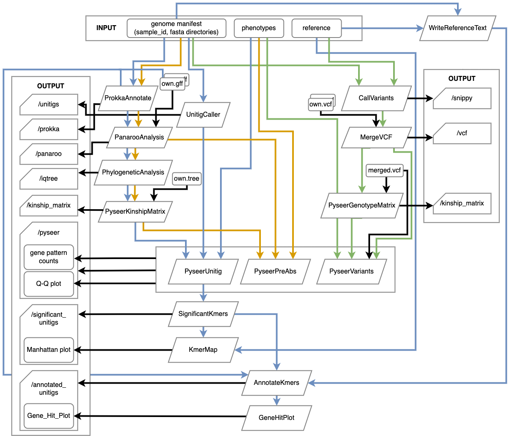

# BaGPipe
_Please bear with me that this manual is still a work in progress. Some paragraphs in this documentation are adapted from my unpublished masters' thesis, so please remember to cite this repository for now._

## Overview
Running a bacterial GWAS isn't that hard, but the pre- and post-processing of data can be boring. I understand the computational complexities ranging from data format conversions to the handling of large genomic datasets. These tasks took precious time away from you, and sometimes bring in small errors that impact the reliability of results. The BaGPipe pipeline integrates a series of bioinformatic tools into a standard, tested workflow for performing bacterial GWAS (see Figure below). 



The most comprehensive way of running BaGPipe starts with genome assemblies, where it performs automated pre-processing including the generation of k-mers (short DNA sequences of length k) or unitigs (longer, non-overlapping sequences assembled from k-mers), annotated assemblies, pangenome, core phylogenetic tree, and the distance/pairwise matrix. Users have the flexibility to enter the workflow at alternative starting points in the pre-processing stage, e.g. supplying their own tree.

For the association analysis, Pyseer (Lees et al, 2018) was used for its speed and design in addressing the common problems of bacterial GWAS like population strucutre, recombination rate, and multiple testing. In the current version (v1.0.0), BaGPipe supports the recommended option (by the Pyseer authors), using a linear mixed model algorithm and unitigs as the input genotype.

In the post-processing stage, BaGPipe automatically performs significant unitig analysis. If the user provides reference files, it can conveniently produce Manhattan plots, annotate the significant unitigs, and eventually produce a gene-hit plot. 

BaGPipe facilitates GWAS analysis on large datasets by easing the computational burden. It optimises the use of requested memory and CPU, which can be customised if necessary. Additionally, an automated resource escalation strategy ensures that a process will be re-run with higher resource requests if the process failed due to lack of memory or runtime on an HPC cluster node.


## Getting started 

### Setting up
You can clone from this repository. You need to have Nextflow. You shouldn't need to set up specific containers for any of the processes used in this pipeline. 

### Example command
BaGPipe is very simple to run under Nextflow. You just need to understand the input required (see Inputs below). I have provided some example input data in the folder "example_input" on this repository. In your command line interface, you can execute BaGPipe after the set-up by something like: 
```
bsub -o job_reports/test1.o -e job_reports/test1.e \
  nextflow run ../gwas_pipeline/main.nf \
    -profile sanger,singularity \
    --manifest genome_manifest.csv \
    --genotype_method unitig \
    --reference reference_manifest.tsv \
    --genus Streptococcus \
    --phenotypes pheno.tab \
    --antibiotic penicillin \
    -resume
```
There are more parameters options and you can explore in the help message (by '-help'). 

### Execution and error handling
The user can run the pipeline using a command line interface, where they need to provide parameters and a configuration file. In case a configuration file is specified, the user must establish the paths for all input files and define the specific analysis along with its related parameters. Alternatively, the user can produce a CSV file (“manifest”) containing the directory paths to all the required input sources and use the default configuration file. The execution can be conducted either locally or expanded to various high-performance computing (HPC) platforms. 

In case of any error during a run, the user can rectify the error and restart the pipeline using the “-resume” command. In doing so, the pipeline utilises previously stored cached files from the last run and proceeds with the corrected processes, without the need to re-run everything again from the top. 

## Inputs

The user must specify, through the option `--genotype_method`, one of the three variant genotype methods:
1. k-mers/unitigs (`unitig`)
2. gene presence or absence (`pa`)
3. SNPs and INDELs (Insertions and Deletions) (`snp`)

If unsure, I recommend the `unitig` approach, as it is a recommended approach by the Pyseer authors. Currently, the unitig option is fully tested but the others are incomplete.

| Input Type        | Format                                                                | Use Case                                                                                        |
|-------------------|-----------------------------------------------------------------------|-------------------------------------------------------------------------------------------------|
| Genomes           | A CSV file listing all sample IDs (first column) and the paths to their FASTA files (second column) | Compulsory                                                                                      |
| Phenotypes        | A TSV file listing all sample IDs (first column) and whether the isolate belongs to each phenotype (0 or 1, each of the other columns) | Compulsory                                                                                      |
| References        | A TSV file listing the paths to reference assemblies (first column) and the paths to their corresponding GFF files (second column) | Significant unitig analysis                                                                     |
| Annotated genomes | A CSV file listing all sample IDs (first column) and the paths to their GFF files (second column) | If the user prefers their own GFFs in “unitig” mode                                             |
| Phylogenetic tree | A phylogenetic tree file for the pangenome in NEWICK format           | If the user prefers their own tree in “unitig” mode                                             |
| Variant file      | A CSV file listing all sample IDs (first column) and the paths to their VCF files (second column) | If the user prefers their own VCFs in “snp” mode                                                |
| Merged variant file | A merged VCF file for all samples                                     | If the user prefers their own merged VCFs in “snp” mode                                         |


## How it works?
### 1. Annotation
Prokka (v.1.14.6) (Seemann, 2014) annotates assembled genomic DNA by employing various tools to predict genomic coordinates and gene functions. Most tools, except Prodigal, provide both coordinates and descriptions; Prodigal solely identifies coding sequence coordinates. Prokka then refines the annotations by comparing the predicted gene coordinates to multiple databases, escalating from smaller, reliable ones to larger, domain- specific collections, ultimately utilising curated protein family models. For each sample, Prokka outputs 10 files with a user-defined "sample_id" prefix. BaGPipe collects all the GFF files into one Nextflow channel for subsequent processing.

### 2. Building multiple sequence alignment of core genes from pangenome
From the annotated assemblies from Prokka or user input, BaGPipe runs Panaroo (v.1.3.4) (Tonkin-Hill et al, 2020) with the option to build a multiple sequence alignment of the core genes using Multiple Alignment using Fast Fourier Transform (MAFFT). Panaroo uses pangenome evolution models instead of gene accumulation curves, and it constructs a graphical pangenome representation, where genes from the nodes and edges link genes that are adjacent on at least one contig. This initial graph is then refined through several cleaning steps to address common issues in genome annotation.

Panaroo outputs several files, including the gene presence/absence format and core and accessory genome alignments, created using the alignment tools MAFFT. The user can select from other alignment tools supported by Panaroo such as Prank or Clustal Omega. The annotated pangenome graph produced by Panaroo is in GML format, compatible with Cytoscape for convenient visualisation. The user can access these outputs and use them in alternative onward analyses, such as the representation of phylogeny and clustering.

### 3. Building phylogeny from the core gene alignment
To control for population structure in the downstream association study, BaGPipe uses IQ-TREE (v.2.2.6) (Nguyen et al, 2015) to build a phylogeny from the core gene alignment. IQ-TREE is a fast stochastic algorithm which constructs phylogenetic trees using a maximum likelihood method. It employs a fast hill-climbing nearest neighbour interchange (NNI) algorithm to generate initially optimal trees, retaining the best topologies based on likelihood. Following this, a stochastic NNI step perturbs these selected trees, allowing for potential escape from local optima. The algorithm re-applies hill-climbing NNI to perturbed trees, iteratively refining them. This recursive process continues until the algorithm identifies the best tree, which remains unchanged through 100 random perturbations. BaGPipe selectively stores the “.treefile” file (Table 2.4) into a channel for downstream processes.

IQ-TREE generates multiple output files, including: 
1.	“.iqtree”: The primary report file which provides detailed computational results and a text-based represen- tation of the final tree. The user can examine this file to understand the outcomes of the run.
2.	“.treefile”: The maximum likelihood tree in NEWICK format, which can be viewed in a tree viewer program that supports the format, such as FigTree or iTOL. 
3.	“.log”: A log file which records the entire process of the run

### 4. Association study
BaGPipe uses Pyseer (v.1.3.11), a non-phylogenetic method and a Python implemen- tation of SEER, to perform GWAS using a linear mixed model. BaGPipe adapts the flexibility given by Pyseer so that the user can choose their preferred methods for doing the association study.

A typical bacterial GWAS requires three types of input: genotype, phenotype, and interaction. One of the options is to study the association between a binary phenotype (i.e. antibiotic resistance) and a binary genotype (i.e. presence/absence) which is created upstream, and the interaction can be the kinship matrix which is produced automatically from the upstream phylogeny in the pipeline. Pyseer can also calculate a pairwise distance matrix that can be used as an interaction from provided genome assemblies using Mash.

From the interaction information it has, Pyseer applies MDS to manage population structure. An alternative, faster method of GWAS supported by Pyseer uses k-mers/unitigs of various lengths to represent genotypic variations is supported by Pyseer. This method has become best-practice and is recommended by the creators of Pyseer.

To control for multiple testing, BaGPipe also counts the number of patterns using scripts from Pyseer and outputs it in a TXT file starting with “pattern_count”. The user can check if this count is reasonably lower than the total number of tested genotypes (k-mers/unitigs/SNPs, etc.), which can aid the decision whether to perform multiple testing corrections. However, this is rarely needed if the k-mer/unitg approach is used.

As a standard protocol, a Q-Q plot is produced after GWAS to assess whether the observed distribution of p-values deviates from the expected distribution under the null hypothesis, i.e., no association between genetic markers and the trait or condition of interest. If the observed p-values deviate systematically from the expected line (which represents the null hypothesis), this could indicate a problem with the study design, population structure, or other confounding factors that may have inflated or deflated the p-values.

If the user selects the k-mer/unitig genotype method (“unitig”), BaGPipe takes steps further in processing those k-mer/unitig outputs, making them more intuitive for the user to analyse the results. First, only the unitigs which exceeded the significance threshold are filtered through. Then, the significant k-mers/unitigs are mapped iteratively to each of the references provided by the user to produce materials for Manhattan plots.

Additionally, BaGPipe automatically annotates the significant k-mers/unitigs. It utilises all the references and the input assemblies as drafts for annotation, then finds annotations for the significant k-mers/unitigs, outputting “gene_hits.tsv”. Annotations labelled “ref” permit partial matches between the k-mers/unitigs and reference sequence, while those marked as “draft” necessitate an exact match. For each significant k-mer/unitig, BaGPipe enriches the output by including the coding genes it resides in, alongside both the closest upstream and downstream coding genes.

While the user can inspect this file directly, there is an example R script provided that can be customised for visualisation. BaGPipe automatically plots these in three different sizes and the user can have a quick look to the overall distribution of p-value and effect size of the annotated genes.

## Output and visualisation
Output files are systematically organised into a hierarchical folder arrangement. The outputs of each process are arranged in independent folders. Additionally, Nextflow generates a separate “work” folder to store intermediate output files, which acts as a specific log for each run.

## Docker and Nextflow implementation of the pipeline
A Docker container has been developed to facilitate the installation of all essential tools and packages, as well as to ensure access to particular versions of these resources. With the Nextflow implementation, the user can run the multi-modular pipeline in one line, specifying which type of input files and GWAS methods they want. BaGPipe can also conveniently be run on an HPC environment supporting the Load Sharing Facility (LSF) executor for swifter processing, as this allows each process to be dispatched as an independent job.

## Customisation
### Configuration file
A single default configuration file is supplied, encompassing all options and parameters for BaGPipe. The user can tailor this file for conducting specific analyses. To simplify the experience for users at all levels of programming knowledge, the configuration file limits modifications to only key parameters. However, experienced users have the option to alter any parameter by changing the source code. Additionally, the user can edit the profile configuration file to run BaGPipe matching the resource settings of their institution’s HPC platform (https://nf-co.re/configs).

## Credits
Pyseer is developed by the Dr. John Lees' team. I would like that thank them for making this amazing tool available. Documentation: https://pyseer.readthedocs.io/en/master

I am supervised by Dr. Ewan Harrison, Dinesh Aggarwal, and William Roberts-Sengier. They are main contributors to ideas in this project. 
